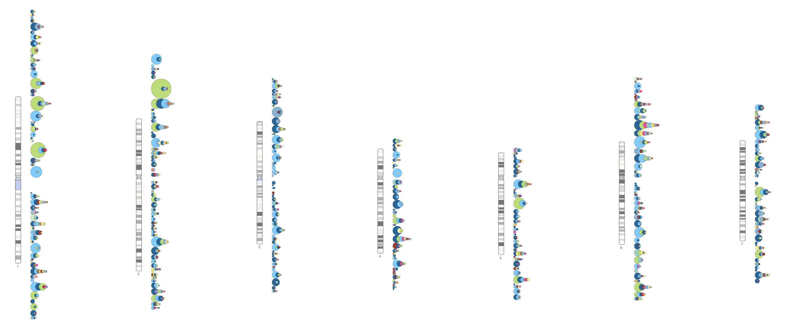

# Experimenting with the GWAS Catalog diagram

## What do we have now

1. Exported GWAS Catalog files are read and compiled into a pandas dataframe.
2. The filtering endpoint of the REST API accepts parameters to filter associations 
(currently supported filters: p-value, pmid, EFO URI, catalog publish date).
3. The returned json contains association counts for each cytobands broken down to trait categories.
4. A primitive UI endpoint proides way to test the diagram.
5. The caryogram of chromosome 1 is loaded as an example.
6. Based on the filters the diagram is updated.
7. The application of filters is additive.

### Run locally (with docker)

```
# clone this repo 
git clone https://github.com/EBISPOT/gwas-diagram.git
cd gwas-diagram
# build docker image
docker build -t gwas-diagram .
# run the app on port 0000
`docker run -i -v ${PWD}:/application  -p 9000:8000 gwas-diagram gunicorn -b 0.0.0.0:8000 app:app -t 1000`
#The first time around the app will need to pull the data, after that it'll be pickled on disk (and you can omit the `-t 1000` timeout for future runs)
```
visit <http://localhost:9000/diagram> in your browser and try it out.


### REST endpoint usage

```bash
curl -X POST "http://localhost:9000/v1/filter" \
    -d pmid='29875488' \
    -d efo='http://www.ebi.ac.uk/efo/EFO_0007937' \
    -d pvalue='1e-30'
```

#### Response:

```json

{
    "10p11.1": {
        "Biological process": 0,
        "Body measurement": 0,
        "Cancer": 4,
        "Cardiovascular disease": 0,
        "Cardiovascular measurement": 0,
        "Digestive system disorder": 0,
        "Hematological measurement": 0,
        "Immune system disorder": 0,
        "Inflammatory measurement": 0,
        "Lipid or lipoprotein measurement": 0,
        "Liver enzyme measurement": 0,
        "Metabolic disorder": 0,
        "Neurological disorder": 0,
        "Other disease": 1,
        "Other measurement": 1,
        "Other trait": 0,
        "Response to drug": 0
    },
...
```


## Example diagram:



## TODO

Roughly representing priority

1. Solve y-axis distribution of the circles to avoid clashing.
2. Extend the applicable filters to further fields.
3. Embed diagram in a canvas to enable download of the diagram as png.
4. DONE Add all chromosomes to the plot.
5. Adding interactivity: cytoband highlight, sphere info etc.

### For the record

The same base caryotypes are used as what the current GWAS Catalog diagram uses. It makes some problem: the cytoband IDs are scientifically correct eg. `1q32.3`. It's nice and stuff, but d3.js cannot select ID starting with numbers and IDs with dot. So these IDs needs to be replaced. 

```bash
export chr=1

cat ${chr}.svg | perl -lane 'BEGIN{ our $chr = $ENV{"chr"}}{
    if ($_ =~ /id=\"($chr.+?)\"/i){
        $old_value = $1;

        $new_value = "cb".$1; 
        $new_value =~ s/\./_/g;
        $_ =~ s/$old_value/$new_value/;
    }
    print $_;
}' > ${chr}_fixed.svg
```
