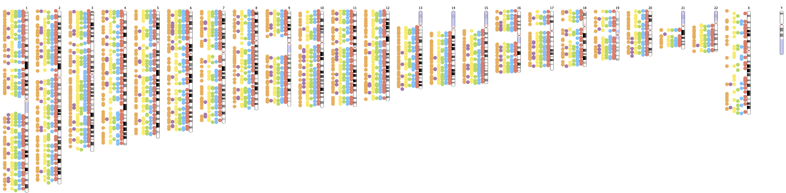

# Experimenting with the GWAS Catalog diagram

[](https://app.codacy.com/gh/DSuveges/gwas-diagram?utm_source=github.com&utm_medium=referral&utm_content=DSuveges/gwas-diagram&utm_campaign=Badge_Grade_Settings)

## What do we have now

1. Exported GWAS Catalog files are read and compiled into a pandas dataframe.
2. The filtering endpoint of the REST API accepts parameters to filter associations at `/v1/plotting_data`
3. Response is an ideogram.js annotations JSON serialised object
   1. The object enables the ideogram to plot a single point for each "parent trait" + "cytoband".
   2. Each association count is given in the "length" attribute
   3. Each unique rsid is given in the name attribute

## TODO
- [ ] Modify the ideogram.js to meet our needs
- [ ] Frontend look and feel 
- [ ] Deployment
- [ ] Connect the filter params ui to the api
- [ ] Maintain the colours from the legend
- [ ] Potentially enforce constraints to avoid plotting too many tracks
- [ ] Investigate use of histogram for visualising number of associations (plotting the length attr)

### Run locally (with docker)

```
# clone this repo 
git clone https://github.com/EBISPOT/gwas-diagram.git
cd gwas-diagram
# build docker image
docker build -t gwas-diagram .
# run the app on port 9000
`docker run -i -v ${PWD}:/application  -p 9000:8000 gwas-diagram uvicorn gwas_diagram.main:app --host 0.0.0.0 --port 8000 --timeout-keep-alive 1000`
#The first time around the app will need to pull the data, after that it'll be pickled on disk (and you can omit the `--timeout-keep-alive 1000` timeout for future runs)
```
visit <http://localhost:9000/docs> in your browser to try out the REST API.


### REST endpoint usage

Example for getting a single pmid of data

```bash
curl -X 'GET' \
  'http://0.0.0.0:9000/v1/plotting_data?pmid=36848389' \
  -H 'accept: application/json'
```

#### Response:

see [ideogram.js](https://github.com/eweitz/ideogram/blob/master/api.md) for more details.

```json

{
  "keys": [
    "name",
    "start",
    "length",
    "trackIndex"
  ],
  "annots": [
    {
      "chr": "10",
      "annots": [
        "rs1",
        1,
        1,
        1
      ]
    }
  ]
}
...
```


## Example diagram:


